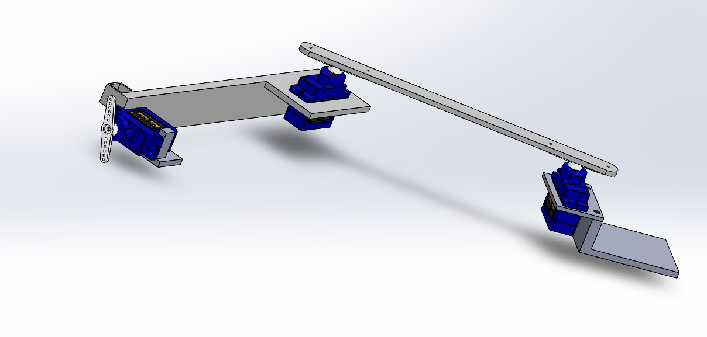

# Two-Axis Pen Plotter

Thanks for checking out this project! To run the plotter, you’ll need to do two things:

1. **Generate the path:** Run `path_gen.py` in the `firmware/` folder. This script outputs a header file that encodes the drawing path.
2. **Run the firmware:** Flash the microcontroller with the firmware, which will use the generated header file to drive the motors and start plotting.

## Path Generation Details

The path generation pipeline uses OpenCV to extract contours from an input image. These contours are then converted into motion commands using inverse kinematics, ensuring the pen moves smoothly and accurately along the desired path.

## Solidwork  

You can find the 3D modeling file under 3D
